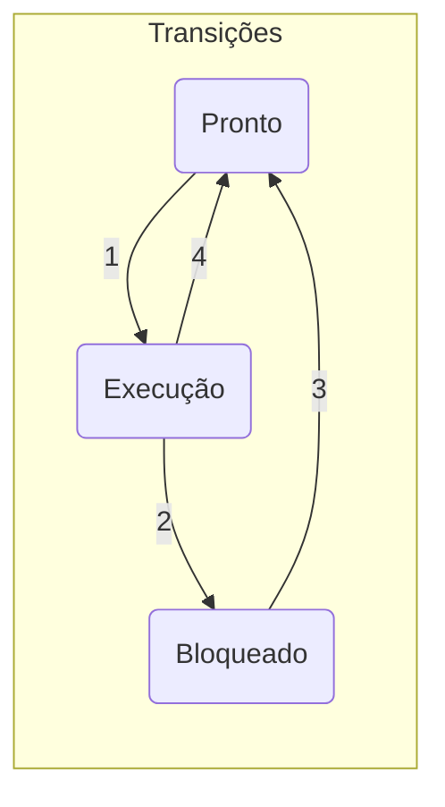
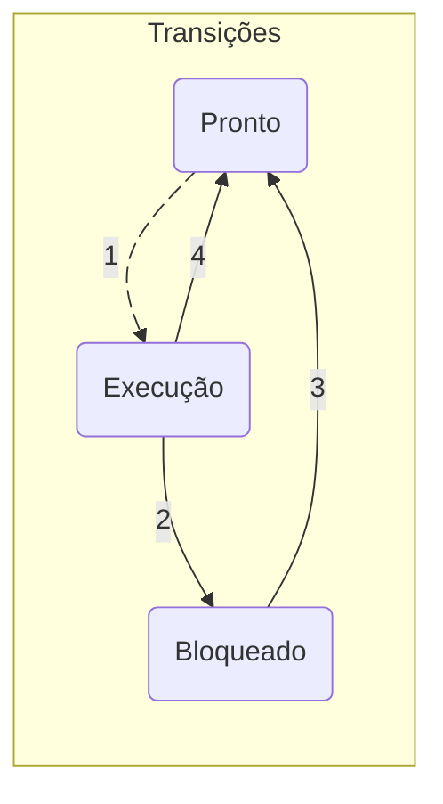
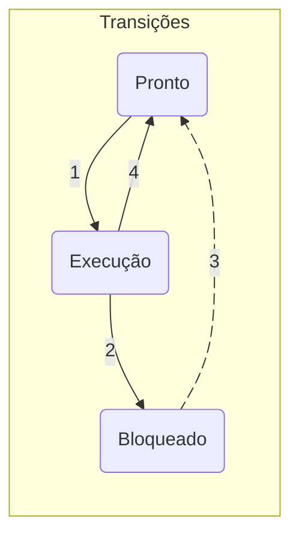
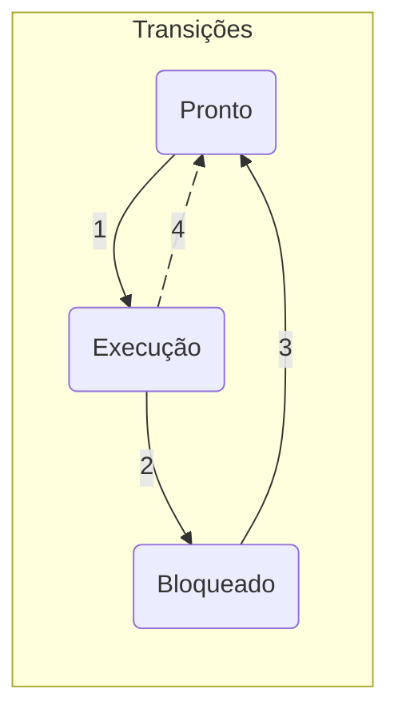

# {{ $slidev.configs.title }}
{{ $slidev.configs.description }}

---

# Objetivo de Aprendizagem
- Conhecer o conceito de processos

---

# Agenda

- Pseudo paralelismo e Multiprogramação
- Processo
- Chamadas de sistema
- Estados dos processos
- Implementação de processos
- Modelagem de Multiprogramação

---

# Pseudo-paralelismo

Durante a execução de um programa do usuário um computador pode também:
- Acessar o armazenamento
- Exibir texto e enviá-lo a impressora
- Receber dados da interface de rede
- Reproduzir um *streaming*
- Realizar a *script* de *backup*

---
layout: quote
---

# Pseudo-paralelismo

> Todas estas ações parecem ser executadas **simultaneamente**, pseudo-paralelismo. A cada instante a CPU alterna entre vários programas.

---
layout: quote
---

# Multiprogramação

> É o mecanismo que permite a CPU realizar **trocas rápidas** entre os diversos processos carregados na memória do sistema.

---
layout: section
---

# Processos

---
layout: statement
---

# Processo e programa são conceitos equivalentes?

---
layout: center
---

$$
Processo = Programa + Contexto
$$

---
layout: quote
---

# Processo
Conceito

> Programa em execução juntamente com os valores atuais do contador de programa, demais registradores e variáveis compartilhadas.

---

# Questionamentos

> Um programa instalado na máquina é um processo?

<br>

> Duas instâncias de um mesmo programa correspondem a quantos processos?

---

# Modelo de processo

- Cada processo é executado sequencialmente
- A CPU alterna incessantemente entre os vários processos na memória (**multiprogramação**)
- Cada processo executa por alguns milisegundos
- O contexto (contador de programa, registradores, variáveis) é salvo a cada troca de processos

---

# Modelo de processo

- A CPU passa a executar outro processo
- A alternância entre processos faz com que o desempenho do sistema não seja uniforme

---

# Analogia

- Receita de bolo (programa)
- Ingredientes (dados de entrada)
- Cozinheiro (CPU)
- A realização da atividade (fazer o bolo) é o processo
- Interrupção pelo filho é a suspensão da tarefa
- Retomar a tarefa a partir do ponto onde foi interrompida

---
layout: two-cols-header
---

# *Foreground* e *background*

:: left ::

**Foreground** 

<br>

Processos em primeiro plano interagem diretamente com o usuário realizando alguma tarefa para eles.

:: right ::

**Background**  

<br>

Processos em segundo plano geralmente são carregados na inicialização do SO e são responsáveis por alguma função específica, mas nem sempre têm interação direta com o usuário.

---
layout: two-cols-header
---

# Exemplos

:: left ::

**Primeiro plano**  

<br>

Gerenciador de arquivos, navegador, editor de texto, planilha, etc

:: right ::

**Segundo plano**

<br>

Gerenciador de impressão, gerenciador de atualização, servidor *web*

---
layout: section
---

# Criação de Processos

---

# Em sistemas elementares de controle

> Em sistemas elementares de controle (micro-ondas, injeção eletrônica, sistemas dedicados, etc) todos os processos são criados na **inicialização**.

<br>

> Em sistemas de uso geral (PC ou Mac, por exemplo), são utilizados mecanismos para criação e término dos processos durante a **operação do sistema**.

---

# Criação de processos
Quando são criados?
- Inicialização do sistema
- Chamada ao sistema para criação de processos
- Requisição do usuário
- *Job* em lote

---

# Inicialização do sistema
Diversos processos são carregados durante a inicialização do sistema

Processos em primeiro plano:
- Gerenciador de login
- Programas configurados para inicialização automática

<br>

Processos em segundo plano (*daemons*):
- Servidores

---

# Chamadas de sistema

> Um processo em execução pode realizar chamadas ao sistema para criação de um ou mais processos para cooperação.

<br>

> **Exemplo** Se uma grande quantidade de dados está sendo trazida pela rede para processamento, é conveniente criar um processo para realizar essa tarefa armazenando as informações em um local de memória compartilhado enquanto um segundo processo os remove e processa.

---
layout: quote
---

# Interação do usuário

> A cada novo programa chamado pelo usuário um ou mais processos são criados. Em sistemas interativos, normalmente a cada processo criado corresponde a pelo menos uma janela onde o usuário envia comandos e recebe respostas do sistema.

---
layout: image-right
image: https://www.precisely.com/wp-content/uploads/2024/07/IBMZ-Mainframe.webp
backgrounsSize: contain
---

# Sistemas em lote

- Característico dos sistemas monoprocessados
- *Mainframes* executam *jobs* enviados remotamente pelos usuários
- O sistema cria os processos à medida em que os jobs são executados

---

# Criação de processos

- `fork` (UNIX/LINUX)
- `CreateProcess()` (Win32)

---

# `fork`
Cria um clone do processo que fez a chamada `fork`

- Processo Pai e processo Filho
- Possuem elementos compartilhados
  - Imagem de memória
  - Arquivos abertos
- Filho executa chamada `execve()` (muda sua imagem de memória).
- Originário do Kernel do Linux.

---

# Exemplo `fork`

```c
#include<stdlib.h>
#include<stdio.h>
#include<unistd.h>

int main()
{
    int i, pid;
    pid = fork();

    if(pid<0)
    {
        fprintf(stderr, "fork falhou\n");
        exit(1);
    }
    if(pid==0)
    {
        printf("Filho\n");
        exit(0);
    }
    printf("pai\n");
}
```

---

# `CreateProcess()`

- Chamada única usada para criação e carga de um novo processo.
- Cria um novo processo e seu fluxo de execução primário (*thread*).
- O novo processo executa o arquivo executável indicado.
- Faz parte da API do Windows.

---

# Exemplo CreateProcess (Win32)

```c
BOOL WINAPI CreateProcess(
  __in_opt     LPCTSTR lpApplicationName,
  __inout_opt  LPTSTR lpCommandLine,
  __in_opt     LPSECURITY_ATTRIBUTES lpProcessAttributes,
  __in_opt     LPSECURITY_ATTRIBUTES lpThreadAttributes,
  __in         BOOL bInheritHandles,
  __in         DWORD dwCreationFlags,
  __in_opt     LPVOID lpEnvironment,
  __in_opt     LPCTSTR lpCurrentDirectory,
  __in         LPSTARTUPINFO lpStartupInfo,
  __out        LPPROCESS_INFORMATION lpProcessInformation
);
```

---

# Término de processos

- Saída normal
  - Conclusão da tarefa
  - `exit` (UNIX) e `ExitProcess` (Win32)
- Saída por erro
  - Inexistência de arquivo

---

# Término de processos

- Erro fatal
  - Acesso a área de memória inválida
  - Divisão por zero
  - Execução de instrução ilegal
- Cancelamento por outro processo
  - `kill` (UNIX)
  - `TerminateProcess` (Win32)

---
layout: section
---

# Estados dos Processos

---

# Estados

- Execução
- Pronto
- Bloqueado

---

# Estados

> **Execução**<br><br>
Estado do processo que detém o controle da CPU em um dado instante.

<br>

> **Pronto**<br><br>
Processo em que seu executável está temporariamente parado à espera da disponibilidade da CPU.

<br>

> **Bloqueado**<br><br>
Não será executado enquanto uma determinada operação (evento externo) não for realizada.

---
layout: center
---



---
layout: two-cols-header
---

# Estados
Transições

:: left ::

1. O processo é selecionado para execução  

:: right ::



---
layout: two-cols-header
---

# Estados
Transições

:: left ::

2. Depois de ser executado por alguns instantes o processo requisita uma operação externa e é bloqueado  

:: right ::


---
layout: two-cols-header
---

# Estados
Transições

:: left ::

3. O evento externo foi concluído e o processo passa ao estado pronto  

:: right ::



---
layout: two-cols-header
---

# Estados
Transições

:: left ::

4. O tempo de CPU do processo em execução se esgotou e um novo processo é escolhido para ser executado

:: right ::



---

# Implementação
Tabela de processos

- Gerenciamento de Processos
- Gerenciamento de Memória
- Gerenciamento de Arquivos

---

# Implementação
Gerenciamento de Processos
- Registradores
- Contador de Programa (PC)
- Palavra de Status do Programa (PSW)
- Estado do Processo

---

# Implementação
Gerenciamento de Memória
- Ponteiro para segmento de código
- Ponteiro para segmento de dados
- Ponteiro para segmento de pilha

---

# Implementação
Gerenciamento de Arquivos
- Diretório de trabalho
- Descritores de arquivos
- UID (*user* ID)
- GID (*group* ID)

---

# Multiprogramação
Modelo

- O uso de multiprogramação amplia a taxa de utilização da CPU.
- Um processo computa apenas durante uma fração do tempo em que permanece na memória (10 a 20%).
- Assim, cinco processos seriam, teoricamente, suficientes para ocupar a CPU.

---

# Multiprogramação
Equação de utilização

> Do ponto de vista probabilístico a utilização da CPU pode ser determinada pela fórmula:
$$U = 1 - p^n$$

Onde:
- $p$ é a fração de tempo que um processo espera pela conclusão das operações de E/S
- $n$ é o número de processos carregados na memória

---

# Exemplo

Considerando que:
- Cada processo passa em média 80% do tempo esperando E/S
- Um sistema com 512MB de memória possui três programas de usuário carregados
- Cada programa possui 128MB, inclusive o SO

<br>

> De quanto seria a taxa de utilização da CPU?

---

# Exemplo
Cálculo

$$
\begin{aligned}
U &= 1 – pⁿ \\
U &= 1 – 0,8^3 \\ 
U &= 1 – 0,512 \\
U &≃ 49\% \\
\end{aligned}
$$

---
layout: section
---

# Dúvidas e Perguntas

---

# Bibliografia

- *Tanenbaum, Andrew S.* Sistemas Operacionais Modernos. 4a. Ed. (**Seção 2.1**)


---
src: /src/end.md
---