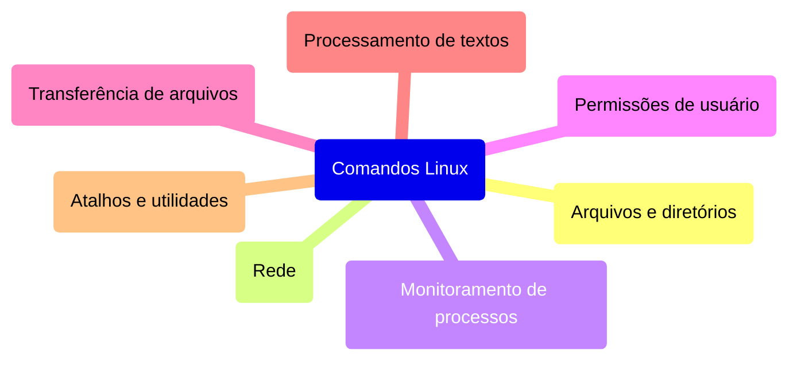

# {{ $slidev.configs.title }}
{{ $slidev.configs.description }}

---

# Objetivo de Aprendizagem
- Aplicar comandos essenciais do Linux

---

# Agenda
- O que é CLI?
- Por que usar linha de comando?
- 50 comandos essenciais

---
layout: section
---

# O que é CLI?

---
layout: quote
---

# O que é CLI?
*Command line interface*

> Interface original dos sistemas operacionais que utiliza-se de um *prompt* e comandos em texto que são executados

---
layout: quote
---

# O que é CLI?
Origem

> Na década de 60 não havia interfaces gráficas ou *mouse*. A interação acontecia basicamente através de comandos que eram digitados pelo usuário.

---
layout: section
---

# Por que usar linha de comando?

---
layout: quote
---

# Por Que Usar Linha de Comando?
*Performance*

> Dispensam GUI (*Graphical User Interface*) que consomem grandes quantidades de memória e processamento. Os comandos de terminal consomem pouquíssima memória e são executados rapidamente pela CPU.

---
layout: quote
---

# Por Que Usar Linha de Comando?
Poucos requisitos

> Não demanda uma interface gráfica, nem mesmo um *mouse*.

---
layout: quote
---

# Por Que Usar Linha de Comando?
Serviços de nuvem

> Permite que serviços de nuvem sejam configurados de forma precisa utilizando conexões remotas (SSH) que utilizam baixa largura de banda.

---
layout: quote
---

# Por Que Usar Linha de Comando?
*Scripts*

> Permitem automatizar tarefas utilizando *scripts* que podem ser agendados no sistema (`cron`)

---
layout: quote
---

# Por Que Usar Linha de Comando?
Outros recursos disponíveis

- Histórico de comandos
- *Autocomplete*
- Encadeamento (*pipes*)

---
layout: section
---

# Desvantagens de Usar CLI

---
layout: quote
---

# Desvantagens

Pontos de atenção ao utilizar CLIs:
- Lembrar dos comandos
- Tratamento de erros
- Curva de aprendizagem

---

# Exemplos de CLI

- MS-DOS
- Command Shell
- CP/M
- Httpie
- Mercurial
- Git
- SSH

---
layout: section
---

# Comandos Essenciais do Linux

---

# Comandos Essenciais do Linux

> Os comandos foram divididos em categorias para facilitar o entendimento, a memorização e o uso

---

# Comandos Essenciais do Linux
Categorias

1. Arquivos e diretórios
2. Rede
3. Monitoramento de processos
4. Gerenciamento e permissões de usuário
5. Transferência de arquivos
6. Processamento de textos
7. Atalhos e utilidades

---

---

# Arquivos e diretórios

| Comando | Descrição | Exemplo |
|---------|-----------|---------|
| `ls` | Lista o conteúdo do diretório. | `ls` |
| `cd` | Altera o diretório. | `cd /path/to/directory` |
| `pwd` | Mostra o diretório atual. | `pwd` |
| `mkdir` | Cria um novo diretório. | `mkdir new_directory` |
| `rmdir` | Remove um diretório vazio. | `rmdir empty_directory` |
| `rm` | Exclui arquivos ou diretórios. | `rm file.txt` |
| `touch` | Cria um arquivo vazio. | `touch new_file.txt` |
| `cp` | Copia arquivos ou diretórios. | `cp file.txt /path/to/destination` |

---

# Arquivos e diretórios

| Comando | Descrição | Exemplo |
|---------|-----------|---------|
| `mv` | Move ou renomeia arquivos. | `mv file.txt /path/to/new_location` |
| `cat` | Exibe o conteúdo do arquivo. | `cat file.txt` |
| `nano / vim` | Edita arquivos no terminal. | `nano file.txt` |
| `find` | Procura arquivos em uma hierarquia de diretórios. | `find . -name "file.txt"` |
| `grep` | Procura texto usando padrões. | `grep "pattern" file.txt` |

---

# Arquivos e diretórios

| Comando | Descrição | Exemplo |
|---------|-----------|---------|
| `tar` | Arquiva e compacta arquivos. | `tar -cvf archive.tar file1.txt file2.txt` |
| `df` | Mostra o uso de disco dos sistemas de arquivos. | `df` |
| `du` | Mostra o tamanho do diretório/arquivo. | `du -sh /path/to/directory` |
| `chmod` | Altera as permissões do arquivo. | `chmod 755 file.txt` |
| `chown` | Altera o proprietário do arquivo. | `chown user:group file.txt` |
| `mount` | Monta um sistema de arquivos. | `mount /dev/sdb1 /mnt` |
| `umount` | Desmonta um sistema de arquivos. | `umount /mnt` |

---

# Rede

| Comando | Descrição | Exemplo de Uso |
|---------|-----------|----------------|
| `ping` | Testa a conectividade com um host. | `ping google.com` |
| `ifconfig / ip a` | Exibe as interfaces de rede. | `ifconfig` ou `ip a` |
| `netstat / ss` | Mostra conexões de rede. | `netstat -tuln` ou `ss -tuln` |
| `wget` | Faz download de arquivos via HTTP/FTP. | `wget http://example.com/file.zip` |
| `curl` | Transfere dados usando sintaxe URL. | `curl -O http://example.com/file.zip` |

---

# Rede

| Comando | Descrição | Exemplo de Uso |
|---------|-----------|----------------|
| `nc (Netcat)` | Depuração de rede e transferência de dados. | `nc -zv 192.168.1.1 80` |
| `tcpdump` | Captura e analisa pacotes de rede. | `tcpdump -i eth0` |
| `iptables` | Configura regras de firewall. | `iptables -A INPUT -p tcp --dport 22 -j ACCEPT` |
| `traceroute` | Rastreia o caminho que os pacotes percorrem até um host de rede. | `traceroute example.com` |
| `nslookup` | Consulta DNS para obter mapeamento de nome de domínio ou endereço IP. | `nslookup example.com` |
| `ssh` | Conecta-se com segurança a um host remoto. | `ssh user@example.com` |

---

# Monitoramento de processos

| Comando | Descrição | Exemplo |
|---------|-----------|---------|
| `ps` | Mostra processos em execução. | `ps aux` |
| `top` | Visualizador dinâmico de processos. | `top` |
| `htop` | Versão aprimorada do top. | `htop` |
| `kill` | Envia um sinal para um processo. | `kill <PID>` |
| `killall` | Finaliza processos por nome. | `killall <process_name>` |
| `uptime` | Tempo de atividade e carga do sistema. | `uptime` |

---

# Monitoramento de processos

| Comando | Descrição | Exemplo |
|---------|-----------|---------|
| `whoami` | Usuário atualmente logado. | `whoami` |
| `env` | Exibe variáveis de ambiente. | `env` |
| `strace` | Rastreia chamadas de sistema de um processo. | `strace -p <PID>` |
| `systemctl` | Gerencia serviços systemd. | `systemctl status <service_name>` |
| `journalctl` | Visualiza logs do sistema. | `journalctl -xe` |

---

# Monitoramento de processos

| Comando | Descrição | Exemplo |
|---------|-----------|---------|
| `free` | Exibe uso de memória. | `free -h` |
| `vmstat` | Relata estatísticas de memória virtual. | `vmstat 1` |
| `iostat` | Relata estatísticas de CPU e I/O. | `iostat` |
| `lsof` | Lista arquivos abertos por processos. | `lsof` |
| `dmesg` | Exibe mensagens do buffer do kernel. | `dmesg` |

---

# Gerenciamento e permissões de usuário

| Comando | Descrição | Exemplo |
|---------|-----------|---------|
| `passwd` | Altera a senha do usuário. | `passwd <username>` |
| `adduser / useradd` | Adiciona um novo usuário. | `adduser <username>` ou `useradd <username>` |
| `deluser / userdel` | Exclui um usuário. | `deluser <username>` ou `userdel <username>` |

---

# Gerenciamento e permissões de usuário

| Comando | Descrição | Exemplo |
|---------|-----------|---------|
| `usermod` | Modifica a conta do usuário. | `usermod -aG <group> <username>` |
| `groups` | Mostra as associações de grupo. | `groups <username>` |
| `sudo` | Executa comandos como root. | `sudo <command>` |
| `chage` | Altera informações de expiração da senha do usuário. | `chage -l <username>` |
| `id` | Exibe informações de identidade do usuário. | `id <username>` |
| `newgrp` | Faz login em um novo grupo. | `newgrp <group>` |

---

# Transferência de arquivos

| Comando | Descrição | Exemplo |
|---------|-----------|---------|
| `scp` | Copia arquivos com segurança via SSH. | `scp user@remote:/path/to/file /local/destination` |
| `rsync` | Sincroniza arquivos e diretórios com eficiência. | `rsync -avz /local/directory/ user@remote:/path/to/destination` |
| `ftp` | Transfere arquivos usando o Protocolo de Transferência de Arquivos. | `ftp ftp.example.com` |

---

# Transferência de arquivos

| Comando | Descrição | Exemplo |
|---------|-----------|---------|
| `sftp` | Transfere arquivos com segurança usando o Protocolo de Transferência de Arquivos SSH. | `sftp user@remote:/path/to/file` |
| `wget` | Faz download de arquivos da web. | `wget http://example.com/file.zip` |
| `curl` | Transfere dados de ou para um servidor. | `curl -O http://example.com/file.zip` |

---

# Processamento de textos

| Comando | Descrição | Exemplo |
|---------|-----------|---------|
| `awk` | Escaneamento e processamento de padrões. | `awk '{print $1}' file.txt` |
| `sed` | Editor de fluxo para filtrar/modificar texto. | `sed 's/old/new/g' file.txt` |
| `cut` | Remove seções de linhas de texto. | `cut -d':' -f1 /etc/passwd` |
| `sort` | Ordena linhas de texto. | `sort file.txt` |
| `grep` | Procura por padrões em texto. | `grep 'pattern' file.txt` |

---

# Processamento de textos

| Comando | Descrição | Exemplo |
|---------|-----------|---------|
| `wc` | Conta palavras, linhas e caracteres. | `wc -l file.txt` |
| `paste` | Combina linhas de arquivos. | `paste file1.txt file2.txt` |
| `join` | Junta linhas de dois arquivos em um campo comum. | `join file1.txt file2.txt` |
| `head` | Exibe a primeira parte dos arquivos. | `head -n 10 file.txt` |
| `tail` | Exibe a última parte dos arquivos. | `tail -n 10 file.txt` |

---

# Atalhos e utilidades

| Comando | Descrição | Exemplo |
|---------|-----------|---------|
| `alias` | Cria atalhos para comandos. | `alias ll='ls -la'` |
| `unalias` | Remove um alias. | `unalias ll` |
| `history` | Mostra comandos inseridos anteriormente. | `history` |
| `clear` | Limpa a tela do terminal. | `clear` |
| `reboot` | Reinicia o sistema. | `reboot` |
| `shutdown` | Desliga o sistema. | `shutdown now` |

---

# Atalhos e utilidades

| Comando | Descrição | Exemplo |
|---------|-----------|---------|
| `date` | Exibe ou define a data e hora do sistema. | `date` |
| `echo` | Exibe uma linha de texto. | `echo "Hello, World!"` |
| `sleep` | Aguarda um tempo especificado. | `sleep 5` |
| `time` | Mede a duração da execução de um comando. | `time ls` |
| `watch` | Executa um programa periodicamente, mostrando a saída em tela cheia. | `watch -n 5 df -h` |

---

# Referências

- [CLI Advantages and Disadvantages](https://itrelease.com/2021/04/advantages-and-disadvantages-of-command-line-interface-cli/)
- [50+ Essential Linux Commands](https://www.digitalocean.com/community/tutorials/linux-commands)

---
src: /src/end.md
---