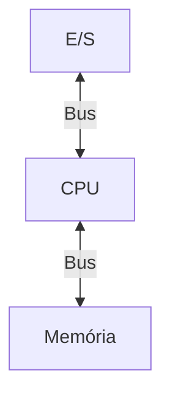
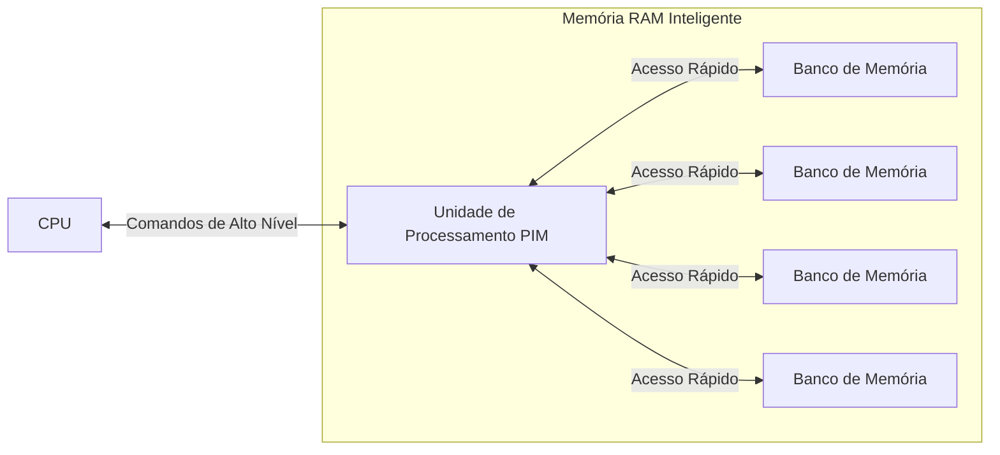

# {{ $slidev.configs.title }}
{{ $slidev.configs.description }}

---

# Objetivo de Aprendizagem

- Conhecer conceitos básicos de Sistemas Operacionais

---

# Agenda
- Conceito de sistema operacional
- Conceito de sistema computacional
- Elementos de um SC
  
---

# Sistema Operacional
Funções de um sistema operacional?
- Estender a máquina
- Gerenciar recursos

---

# SO como máquina estendida
- Apresentar ao usuário/programador uma máquina estendida e acessível e ainda que seja mais fácil de programar do que o hardware diretamente.
- Fornece uma variedade de serviços que os programas podem obter usando instruções especiais (chamadas de sistema, *system calls*)

---

# SO como máquina estendida
- Camada intermediária que facilite e uniformize o acesso aos recursos computacionais
  - Memórias
  - Dispositivos de E/S

---

# SO como gerenciador de recursos
- Fornecer uma alocação ordenada e controlada de processadores, memórias e dispositivos de E/S entre vários programas que competem pelo uso destes recursos

---
layout: section
---

# Sistema Computacional

---

# Sistema Computacional

> O que é um sistema computacional?

> Onde encontramos um sistema computacional?

> Qual a finalidade de um sistema computacional?

---

# Sistema Computacional
- CPU
- Memória
- Barramento do sistema
- Periféricos (E/S)

---
layout: center
class: text-center
---

# Arquitetura de *Von Neumann*

---

# Sistema Computacional
- Processa os dados e controla o sistema
- CPU
- Memória armazena instruções e dados
- Barramento do sistema: “auto-estrada” para dados e instruções
- Periféricos: permite a entrada e a saída de dados

---

# Exemplos de SC

- *Mainframes*
- *Desktops*
- Laptops
- Smartphones
- *Tablets*
- Alguns eletrodomésticos

---

# Outros Exemplos de SC

- Sistemas dedicados de controle
  (Injeção eletrônica, Controle de airbag, Controle da Climatização, Controle de elevadores)

---

# Sistemas de Computação em Memória 
*Processing-in-Memory - PIM*

Exemplo: Samsung HBM-PIM

> O que é: É um módulo de memória de alta performance (HBM) onde cada chip de memória tem um pequeno processador (DRAM processing unit) embutido dentro dele.

> Caso Prático: Em vez de um servidor de IA ter que mover terabytes de dados do módulo de memória RAM para a GPU para fazer cálculos (um processo lento e que consome muita energia), a GPU pode enviar a operação para ser executada dentro da própria memória. Isso é revolucionário para tarefas de big data e machine learning, reduzindo drasticamente o consumo de energia e o tempo de processamento.

---

[HBM-PIM](https://semiconductor.samsung.com/news-events/tech-blog/hbm-pim-cutting-edge-memory-technology-to-accelerate-next-generation-ai/)

---

# Processadores (CPU)

- Funções essenciais
  - *clock*
  - Gerenciamento de energia
  - Sinalização e Controle
- Ciclo básico
  - Busca (instruções na memória)
  - Decodificação (para determinar os operandos)
  - Execução

---

# Transferência de dados
- Entre memória e dispositivos de entrada/saída (E/S)
- Responder interrupções externas
- Prover sinais de temporização e controle

---

# Instruções
- Cada CPU possui um conjunto específico de instruções
  - Aritméticas
  - Lógicas
  - Transferência de dados
  - Desvio
- Registradores internos
  - Program Counter
  - PSW (Program Status Word)

---

# Instruções
- Registradores internos
  - *Program Counter* (PC)
  - *Program Status Word* (PSW)

---

# Ciclo convencional
- Busca Instrução
- Decodifica Instrução
- Executa Instrução

---

# *Pipeline*

- Consiste em aceitar novas instruções antes que as aceitas previamente tenham terminado
- Permite a CPU 'executar' mais de uma instrução ao mesmo tempo
- Unidades independentes de busca, decodificação e execução
- Enquanto executa a instrução n, decodifica a instrução n+1 e busca a instrução n+2

---
layout: image
image: https://blog.pantuza.com/uploads/5903534f86b5e369d1c4b572df8dc20f9235c2fd
backgroundSize: contain
---

---
image: https://blog.pantuza.com/uploads/e7f879d62220d0977a7254d90c3fe46f71440cc5
layout: image
---

---
layout: quote
---

# *Pipeline*

> Executa múltiplas instruções em "paralelo" possibilitando maximizar o uso dos recursos e reduzir o tempo global de execução das tarefas

---
layout: quote
---

# Arquitetura Superescalar
> Arquiteturas Superescalares são aquelas capazes de buscar, decodificar e executar mais de uma instrução por ciclo de máquina (paralelismo real)

---

# Arquitetura Superescalar

- Possui múltiplas unidades de execução
  - Números inteiros
  - Ponto Flutuante
  - Operações lógicas
- A cada ciclo são buscadas e decodificadas duas ou mais instruções e colocadas em um buffer
- À medida que uma unidade de execução está livre as instruções são executadas

---
layout: image
image: https://wiki.ifsc.edu.br/mediawiki/images/0/01/MIPprocpipelined.png
backgroundSize: contain
---

---

# Modo Núcleo e Usuário

- Controlado pelo PSW
- Modo Núcleo
  - Qualquer instrução pode ser executada
  - Sistema operacional roda neste modo
- Modo Usuário
  - Não permite o uso de instruções que envolvem E/S e proteção de memória são inacessíveis
  - Programas de usuário utilizam este modo
- Chamadas ao sistema que incluem a instrução TRAP alterna entre os modos

---
layout: quote
---

# GPU
*Graphics Processing Unit*

> Processador especializado originalmente projetado para renderizar imagens e vídeos em alta velocidade

---

# GPU
GPU x CPU

> A principal diferença entre uma GPU e uma CPU está na arquitetura e função

 

- **CPU** Tem poucos núcleos de processamento, mas cada um é muito poderoso e capaz de executar uma ampla variedade de tarefas complexas e sequenciais
- **GPU** Contém milhares de núcleos menores e menos poderosos que os da CPU. No entanto, sua grande quantidade de núcleos permite processar muitas tarefas simples ao mesmo tempo, de forma paralela

---

# GPU
Tipos
- GPU integrada (iGPU): Embutida no mesmo chip da CPU
- GPU dedicada (ou discreta): Um chip separado, com sua própria placa de circuito e memória de vídeo (VRAM)
- GPU virtual (vGPU): Uma versão baseada em software de uma GPU físicae disponível em ambientes de nuvem

---

# Memória
Memória Ideal

- Rápida (mais veloz que a execução de uma instrução pela CPU)
- Abundante
- Baixo custo

---

# Existem vários níveis/tipos de memória
- Registradores
- *Cache*
- RAM (Principal)
- Discos

---

# Registradores
- Internos a CPU e constituídos do mesmo material
- Não impõe atrasos a CPU
- Capacidades típicas
  - 32x32 bits (máquinas 32 bits)
  - 64x64 bits (máquinas 64 bits)

---

# Memória cache

- Divide-se a memória principal em linhas
- As posições de memória mais utilizadas são copiadas para a cache
- Quando um programa faz uma busca na memória o hardware que gerencia a MC, procura pelo endereço na cache
- Caso esteja responde a requisição, caso contrário faz uma busca na memória principal
- O tempo de resposta da *cache* equivale a 2 ciclos de CPU

---

# Memória Principal
- RAM (*Random Access Memory*)
- Ordem de Gigabytes
- Possui unidade de gerenciamento própria (MMU)

---

# Memory Management Unit (MMU)
- Proteger os programas de outros programas e o SO de todos os programas
- Realocar a memória
- Registrador-base e Registrador-limite

---

# Memória permanente
Discos Magnéticos (Obsoletos)
  
  - Capacidade de armazenamento superior comparada a RAM
  - Tempo de acesso aleatório (dezenas de ms)
  - Velocidades 5400, 7200 e 10800 rpm

---

# Memória permanente
Unidade de Estado Sólido (SSD)

- *Solid State Device* 
- Tempos de acesso
  - *Read Time* (tR):	40 µs
  - *Program Time* (tProg):	347 µs
  - *Block Erase Time* (tBERS):	3.5 ms

---

# Dispositivos de E/S

- Duas partes:
  - Controlador (*Driver*)
  - Próprio dispositivo de E/S
- Driver de Dispositivo é o software necessário para que o SO possa controlar o dispositivo
  - São específicos para cada dispositivo e SO

---

# Três formas de E/S
- Espera ociosa (*Busy waiting*)
- Interrupções
- DMA (*Direct Memory Access*)

---

# Espera Ociosa
*Busy Waiting*

1. Programa emite chamada ao sistema para acessar determinado dispositivo
2. SO, por sua vez, faz chamada ao respectivo *driver* de dispositivo
3. O driver inicia um loop perguntando **continuamente** ao dispositivo se a operação de E/S foi concluída
4. Quando isto acontece o driver escreve os dados em memória e retorna ao SO
5. O controle é devolvido ao programa

---

# Interrupção
1. Programa necessita de operação de E/S
2. Utilizando interrupção o *driver* inicia o dispositivo e devolve o controle da CPU ao SO
3. O SO bloqueia o programa enquanto a operação de E/S é concluída
4. SO busca outras tarefas para executar
5. Quando a E/S é concluída o dispositivo gera uma interrupção e o SO volta a dar atenção ao dispositivo
6. SO devolve o controle ao programa

---

# DMA
*Direct Memory Access*

- *Hardware* especial para tratar as interrupções
- Os dispositivos escrevem diretamente na memória sem a intervenção da CPU
- Evita que o SO tenha de copiar os dados do *buffer* do dispositivo para a memória do sistema

---
layout: quote
---

# Barramentos

> Um barramento (*bus*) é um conjunto de linhas de comunicação (condutores elétricos, traços em uma placa de circuito) que permite a transferência de dados, endereços e sinais de controle entre os diversos componentes de um computador. Eles são as "rodovias" por onde trafegam as informações.

---

# Barramentos
Características

- Largura (*Width*): Número de bits que podem ser transmitidos simultaneamente (ex: 32, 64 bits).
- Velocidade (*Clock Speed*): Frequência de operação, medida em Hertz (Hz), MHz ou GHz.
- Taxa de Transferência (*Bandwidth*): Volume de dados transmitidos por segundo, medido em MB/s ou GB/s. Calculado por:

---

# Barramentos
Tipos
- Barramentos Internos (On-Chip / Sistema)
- Barramentos de Expansão
- Barramentos de Armazenamento
- Barramentos de Entrada e Saída (I/O)

---
layout: quote
---

# Barramentos
Sistema

> Conectam os componentes internos da CPU (Unidade de Controle, ALU, Cache L1/L2) e a CPU aos outros componentes diretamente soldados na placa-mãe (como a memória RAM).

---

# Barramentos
Sistema

1. ***Front-Side Bus***; Era o barramento principal que conectava a CPU ao Northbridge, que por sua vez se comunicava com a memória RAM e barramentos de expansão (obsoleto)

---

# Barramentos
Sistema

2. **Barramento de Memória**; Conexão direta entre o controlador de memória integrado na CPU e os módulos de RAM.
    - DDR5 SDRAM: A mais recente, oferecendo maiores velocidades e eficiência energética
    - DDR4 SDRAM: Ainda muito comum em sistemas atuais
    - LPDDR4X/LPDDR5: Versões de baixo consumo para laptops e dispositivos móveis

---

# Barramentos
Sistema

3. **Interconexões Point-to-Point**; Conectam a CPU a outros chips de forma direta e dedicada (substituem o FSB)
    - Intel DMI (*Direct Media Interface*)
    - PCIe (*Peripheral Component Interconnect Express*)
      - Conecta a CPU diretamente a dispositivos de alta velocidade, como GPUs e SSDs NVMe, sem passar pelo chipset

---

# Barramentos
Expansão
  - Permitem a conexão de placas adicionais à placa-mãe para expandir a funcionalidade do computador
  - PCI e AGP (*Advanced Graphics Port*) (obsoletos)
  - PCIe (Padrão atual)
    - PCIe 3.0: Muito comum
    - PCIe 4.0: Padrão atual na maioria dos sistemas novos.
    - PCIe 5.0: Emergente, presente nas placas-mãe e CPUs mais recentes (alta performance para GPUs e SSDs)
    - PCIe 6.0: Anunciado, ainda não no mercado consumidor.

---
layout: quote
---

# Barramentos
Armazenamento

> Conectam unidades de armazenamento (discos rígidos, SSDs) à placa-mãe

---

# Barramentos
Armazenamento
- SATA (Serial ATA)
- SAS (*Serial Attached SCSI*)
- NVMe (*Non-Volatile Memory Express*)

---

# Barramentos
Armazenamento

**SATA (*Serial ATA*)**

- SATA III (3.0): Taxa de transferência de até 6 Gb/s (~600 MB/s). É o padrão mais comum para SSDs e HDs de consumo.
- Sendo gradualmente substituído por NVMe para SSDs de alto desempenho

---

# Barramentos
Armazenamento

**SAS (*Serial Attached SCSI*)**

- Barramento projetado para servidores. Oferece maior confiabilidade, velocidade e suporte a mais dispositivos por controlador

---

# Barramentos
Armazenamento

**NVMe (*Non-Volatile Memory Express*)**

- É um protocolo de comunicação projetado especificamente para memórias *flash* (SSDs) que utiliza o barramento PCIe
- Explora a baixa latência e alta largura de banda do PCIe, oferecingo velocidades muito superiores ao SATA (leituras sequenciais podem exceder 7.000 MB/s)

---
layout: quote
---

# Barramentos
I/O

> Conectam periféricos externos ao computador.

---

# Barramentos
I/O
- USB (*Universal Serial Bus*)
- Thunderbolt

---

# Barramentos
I/O

**USB**

- USB 2.0: Até 480 Mb/s. Comum para dispositivos de baixa velocidade
- USB 3.2 Gen 1 (USB 3.0): Até 5 Gb/s, conectores geralmente azuis
- USB 3.2 Gen 2 (USB 3.1): Até 10 Gb/s
- USB4: Até 40 Gb/s, baseado no protocolo Thunderbolt 3

---

# Barramentos
I/O

**Thunderbolt**

> Desenvolvido pela Intel em parceria com a Apple. Combina dados, vídeo e energia em uma única conexão

 

> Thunderbolt 3 e 4: Usam o conector USB-C e oferecem até 40 Gb/s. Podem drives externos ultrarrápidos, monitores de alta resolução e docks stations

---

| Barramento | Função Principal | Taxa de Transf. Típica | Status |
| :--- | :--- | :--- | :--- |
| **Barramento de Mem DDR5** | CPU ↔ RAM | ~ 40-50 GB/s | **Padrão Atual** |
| **PCIe 5.0 x16** | CPU ↔ GPU | ~ 63 GB/s | **High-End** |
| **PCIe 4.0 x4 (NVMe SSD)** | CPU ↔ SSD NVMe | ~ 7.9 GB/s | **Padrão Atual** |
| **Thunderbolt 3 / 4 / USB4** | Periféricos de alta velocidade | 5 GB/s (40 Gb/s) | **Premium / Crescente** |
| **USB 3.2 Gen 2** | Periféricos externos | 1.25 GB/s (10 Gb/s) | **Comum** |
| **SATA III** | HDs / SSDs SATA | 600 MB/s (6 Gb/s) | **Em declínio** |
| **USB 2.0** | Periféricos lentos | 60 MB/s (480 Mb/s) | **Ainda presente** |
| **PCI / PCI-X** | Expansão (placas antigas) | 133 - 533 MB/s | **Obsoleto** |

---
layout: fact
---

# Perguntas

---

# Referências
- Tanenbaum, A. S. Sistemas Operacionais Modernos. 4a. Edição. Editora Pearson. (Capítulo 1)

---

# Referências

- [O que é uma CPU?](https://www.ibm.com/br-pt/think/topics/central-processing-unit)
- [O que é uma GPU?](https://www.ibm.com/br-pt/think/topics/gpu)

---
src: /src/end.md
---